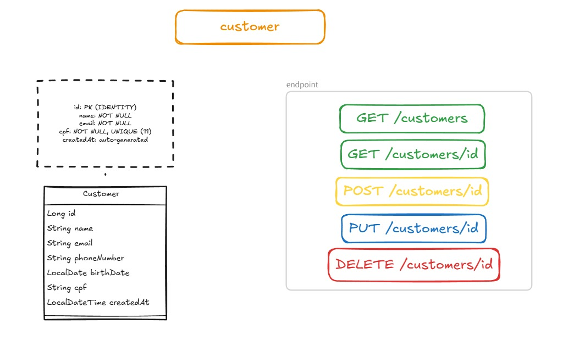

# Customer Service — Subscribo

Microserviço responsável por **gerenciar clientes (Customers)** na plataforma Subscribo.

## Responsabilidade
- Criar, consultar, atualizar e remover clientes
- Garantir integridade básica (ex.: **CPF único**)
- Expor dados do cliente para outros serviços (ex.: Subscription/Access)

> Fora do escopo: planos, assinaturas, cobrança, acesso, autenticação.

## Endpoints
- `POST /customers` → cria cliente (**201**)
- `GET /customers` → lista clientes (**200**)
- `GET /customers/{id}` → busca por id (**200** / **404**)
- `PUT /customers/{id}` → atualiza dados editáveis (**200**)
- `DELETE /customers/{id}` → remove cliente (**204**)


## Regras
- `cpf` é **único** (conflito → **409**)
- `birthDate` é obrigatório (base para regras futuras de idade)
- Cliente não encontrado → **404**
- 
## Erros (padrão)

As respostas de erro seguem um formato consistente:

```json
{
  "status": 404,
  "message": "Customer with id 10 not found"
}
